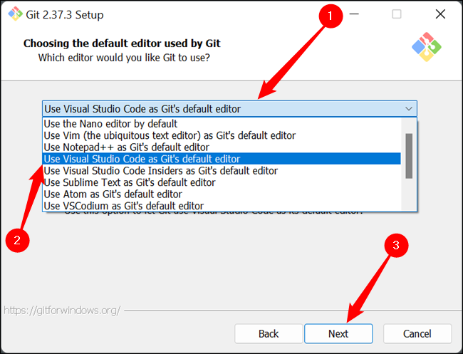

# Большая шпаргалка по работке с *Git*, *Git Hub* и *MarkDown*
Оглавление:
1. Подготовка действий для работы с программами. --- **_Rustamoff_**
2. Работа с **_MarkDown_** Тонкости и плюсы. --- **__Shmid__**
3. [Начало работы с **Git** в *Visual Studio Code* и немного магии.](#title3) --- **_Fennellis_**
4. Основные команды в *Git*. --- **_Evgenichka_**
5. Ветки в *Git* ветвление/слияние/конфликты. --- **_KiritoSV_**
6. Начало работы в **_Git Hub_**. --- **_Osman_**
7. Проверка коммитов и веток в **_Git Hub_**, коментарии для участников проекта(Редактирование). --- **_Sallta_**
8. Наглядное пособие (контент, доп. программы для упрощения работы разработчика).
10. Работа с удалёнными репозотриями через локалный терминал. --- **_Sofyamamamia_**
11. Как работать в команде ***(Soft skill`s`)***, идеи и трудности.
12. Основные ошибки при работе с *Git*, *Git Hub* и *MarkDown*. --- **_AlionaJe_** 
13. Советы по работе над проектами
14. Немного о *Python* на *Vs Code*
15. Благодарность самим себе и напутствия для остальных!
* Финал *LoveStory*
<<<<<<< HEAD
=======

## <a id="title3">Начало работы с _**Git**_ в Visual Studio Code</a>
### Установка Git
Для того, чтобы начать работать с Git, необходимо его установить на устройство, в котором будет осуществляться работа. Например, для ОС Windows его можно скачать с сайта https://gitforwindows.org/

>Во время установки Git можно заранее указать, в какой программе Вы будете его использовать, а также выбрать другие настройки под свои нужды (для опытных пользователей).



### Инициализация
Все команды Git выполняются в терминале. Открыть новый терминал можно на панели сверху во вкладке `Терминал -> Создать терминал`. После этого в нижней части программы откроется область встроенного терминала с указанием текущей папки. Для перемещения между папками используется команда `cd <путь_папки>` либо можно воспользоваться функцией `Файл -> Открыть папку`. Путь папки можно посмотреть и скопировать в верхней части окна папки. Текущий путь, с которым работает терминал, можно увидеть в начале (или над) каждой вводимой строки терминала.

Для того, чтобы папка стала репозиторием, необходимо прописать в терминале команду `git init`. **ВАЖНО!** Убедитесь, что терминал работает с нужной Вам папкой.

Если Вы ранее не работали с Git на этом устройстве, программа предложит вам "авторизоваться". Напишите следующие команды используя свои данные:
``` C#
git config --global user.name "Your_Name"
git config --global user.email Your_Email@example.com
```
Если не появилось никаких ошибок, значит Вы авторизовались. В дальнейшем при просмотре имеющихся коммитов (например командой `git log`) Вы увидите кем и когда он был создан.
Проверить статус Git можно командой `git status`.
>>>>>>> fennellis
